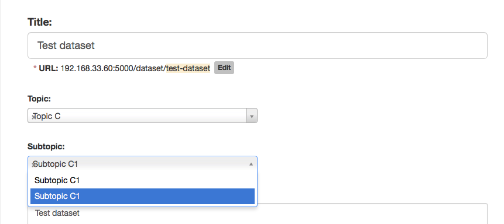

# ckanext-topics

Topics and subtopics for classifying datasets in CKAN. Tested for CKAN **2.7.2**

## Features

This extension provides mechanisms for classifying your datasets in a hierarchy of topics and subtopics. This topics will appear under the *Additional info* of the dataset:


Topics and subtopics can be assigned to a datasets in its edit page. The available subtopics will be filtered by the selected topic:



Then you can filter search results by a specific topic or subtopic:


Sysadmins can view the complete list of topics and edit them:


Reordering of topics and subtopics is available, but is a bit tedious to do (see [Limitations and tradeoffs](#limitations-and-tradeoffs))

## Limitations and tradeoffs

When we started the implementation of this features, we had two possible approaches:

1. Create a new model to support topics and subtopics, with the associated complexity of managing database migrations, taking care of the faceted search etc.
2. Adapt existing CKAN features for this purpose. In this case [Tag Vocabularies](http://docs.ckan.org/en/latest/maintaining/tag-vocabularies.html)

We opted for 2, which had the following advantages and disadvantages:

**Advantages**

* We didn't have to bother about adding a new model to CKAN, creating its database table, indexing this new model in Solr etc.
* Faceted search was pretty easy to implement.

**Disadvantages**

The [Tag Vocabularies](http://docs.ckan.org/en/latest/maintaining/tag-vocabularies.html) feature is not prepared to support making a hierarchy of them, nor ordering. We have two tag vocabularies, one for topics and other for subtopics:

```
ckan_default=# select * from vocabulary;
                  id                  |       name
--------------------------------------+------------------
 69f6965b-5fb1-4736-b4d8-44a1bad6ea7c | custom_topics
 d9ec0caf-14b4-42b6-91a2-1acfee4b0a96 | custom_subtopics
```

Now, in the `tag` table we store both topics and subtopics. In the `name` column we store:

* Topic index + topic name for topics
* Parent topic index + subtopic index + subtopic name for subtopics

```
ckan_default=# select * from tag;
                  id                  |      name       |            vocabulary_id
--------------------------------------+-----------------+--------------------------------------
 77395512-9db2-437b-a70a-f4068164964b | a_Topic A       | 69f6965b-5fb1-4736-b4d8-44a1bad6ea7c
 39be456d-353c-4962-9971-09b24b95f045 | b_Topic B       | 69f6965b-5fb1-4736-b4d8-44a1bad6ea7c
 c60dff29-71e7-40c8-84b2-aabda8facfdf | a_a_Subtopic A2 | d9ec0caf-14b4-42b6-91a2-1acfee4b0a96
 bdfd0255-98aa-447c-b3e1-7e44c8e0c8b6 | b_a_Subtopic B1 | d9ec0caf-14b4-42b6-91a2-1acfee4b0a96
 8119723f-64d3-453d-b474-5ada94391f58 | b_b_Subtopic B2 | d9ec0caf-14b4-42b6-91a2-1acfee4b0a96
```

The obvious disadvantage is that is pretty easy to mess up data consistency: when a topic is updated or deleted, we need to update its subtopics and decrease the index of all the topics and subtopics that come after.

Also, when changing the index (ordering) of a topic whe have taken care that the subtopics get updated accordingly, but we're currently not checking if that index is currently in use (PRs welcome).

We tried to encapsulate most of the logic for dealing with topics and subtopics in `lib/topic.py` and `lib/subtopic.py`. We had to find a balance also between avoiding duplication in this classes and avoiding the performance problems that came up from using the CKAN API to perform this operations instead of directly using the ORM.

## Setup

Follow the regular procedure for installing CKAN extensions:

1. Clone the repository in `/usr/lib/ckan/default/src/` (or equivalent)
2. Install the extension:

```bash
. /usr/lib/ckan/default/bin/activate
cd /usr/lib/ckan/default/src/ckanext-topics
python setup.py develop
```

3. Add the `topics` plugin to the `ckan.plugins` line in the `.ini` configuration file.
4. To create the `custom_topics` and `custom_subtopics` vocabularies, and fill them with some sample topics and subtopics, you can load the [seeds](#seeds) we provide.

### Seeds

```bash
cd seeds
cp config.example.yml config.yml # and fill the values
bundle install
ruby run.rb
```

## Pending work

Many things!

* Code cleaning
* Write tests
* Don't link a subtopic to its parent by the parent index, use its ID instead
* The UI for managing topics is very rudimentary
* Fix:

> we're currently not checking if that index is currently in use (PRs welcome).

## Contact

This extension has been developed by [Populate](http://populate.tools), a studio which designs and builds products around civic engagement, data journalism and open data.